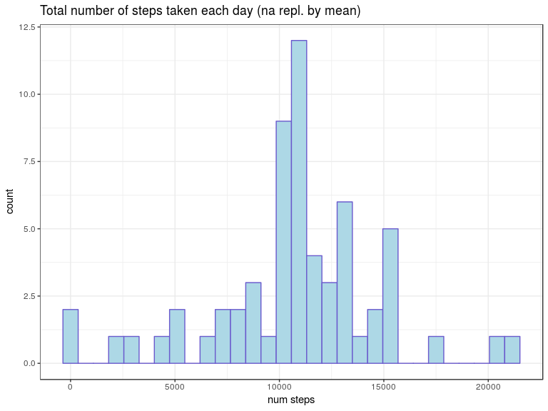

## Loading and preprocessing the data
  Original file is part of the repository so no need for download.  
  However we could be fancy here, and call the following function with the zip version, in this case we unzip the file, before loading it.  
  Load csv file into a dataframe and convert the character column date to type Date (while loading).
  

```r
# Definition (function)
loadFile <- function(filename="./activity.csv") {
  l <- strsplit(basename(filename), c("\\."))
  prefix <- l[[1]][[-2]]
  suffix <- l[[1]][[-1]]
  if (suffix == "zip") {
    unzip(filename)
    filename <- paste(prefix, "csv", sep=".")
    print(filename)
  }
  if (!file.exists(filename)) stop("filename not found")
  
  # Convert character date column to date type             
  setAs("character", "Date", function(from) { as.Date(from, format="%Y-%m-%d") })

  read.csv(filename, header=TRUE, na.strings="NA", stringsAsFactors=FALSE,
           colClasses = c("integer", "Date", "integer"),
           col.names = c("steps", "date", "interval"))
}

# Call 
dfr <- loadFile() 
class(dfr$date)
```

```
## [1] "Date"
```

```r
# Switch to dplyr
library(dplyr)
# Convert to tibble
mytab <- tibble::as.tibble(dfr)
dfr <- NULL # Recycle

# A peek at the data
str(mytab)
```

```
## Classes 'tbl_df', 'tbl' and 'data.frame':	17568 obs. of  3 variables:
##  $ steps   : int  NA NA NA NA NA NA NA NA NA NA ...
##  $ date    : Date, format: "2012-10-01" "2012-10-01" ...
##  $ interval: int  0 5 10 15 20 25 30 35 40 45 ...
```

## What is mean total number of steps taken per day?
  **For this part of the assignment, we can ignore the missing values in the dataset.**

### 1 - Calculate the total number of steps taken per day
  *Note*: Eliminating the NA values, to simplify subsequent calculations.
  

```r
num_steps_per_day <- mytab %>%
  filter(!is.na(steps)) %>% 
  group_by(date) %>%
  summarize(num_steps = sum(steps))

head(num_steps_per_day)
```

```
## # A tibble: 6 x 2
##   date       num_steps
##   <date>         <int>
## 1 2012-10-02       126
## 2 2012-10-03     11352
## 3 2012-10-04     12116
## 4 2012-10-05     13294
## 5 2012-10-06     15420
## 6 2012-10-07     11015
```

### 2 - Make a histogram of the total number of steps taken each day
  *Note*: histograms are plots we used to explore how one (or several) quantitative variable(s) are distributed in term of count/frequency.
  

```r
library(ggplot2)

qplot(num_steps, data=num_steps_per_day) +
  geom_histogram(color="slateblue", fill="lightblue") +
  xlab("num steps") +
  ggtitle("Total number of steps taken each day") + theme_bw()
```

<!-- -->

  *Note*: Using `binwidth` parameter

```r
# Determine binwidth 
v <- range(num_steps_per_day$num_steps)
min <- v[[1]]
max <- v[[2]]
bwidth <- (max - min) / 30

qplot(num_steps, data=num_steps_per_day, binwidth=bwidth) +
  geom_histogram(color="slateblue", fill="lightblue", binwidth=bwidth) +
  xlab("num steps") +
  ggtitle("Total number of steps taken each day") + theme_bw()
```

<!-- -->


### 3 - Calculate and report the mean and median of the total number of steps taken per day
  *Note*: No need to specify `na.rm=TRUE` when calling `mean()` and `median()` as  we filtered out the NA values.


```r
summary_steps_per_day <- num_steps_per_day %>%
  select(num_steps) %>%
  summarize(mean.numsteps = mean(num_steps), 
            median.numsteps = median(num_steps))

summary_steps_per_day
```

```
## # A tibble: 1 x 2
##   mean.numsteps median.numsteps
##           <dbl>           <int>
## 1        10766.           10765
```
  So the mean is `10766`, while the median is `10765`.
  
## What is the average daily activity pattern?

### 1 - Calculate mean number of steps per interval (of 5 minutes)


```r
steps_by_interval <- mytab %>%
   group_by(interval) %>%
   summarize(mean = round(mean(steps, na.rm=TRUE), 4))

str(steps_by_interval)
```

```
## Classes 'tbl_df', 'tbl' and 'data.frame':	288 obs. of  2 variables:
##  $ interval: int  0 5 10 15 20 25 30 35 40 45 ...
##  $ mean    : num  1.717 0.3396 0.1321 0.1509 0.0755 ...
```

### 2 - Make the plot

```r
ggplot(steps_by_interval, aes(x = interval, y = mean)) + 
  geom_line(color="slateblue") + theme_bw()
```

<!-- -->

### 3 - Find the maximum mean number of steps per 5-minute interval across all the days 


```r
steps_by_interval_max <- steps_by_interval %>%
  filter(mean == max(mean))

steps_by_interval_max 
```

```
## # A tibble: 1 x 2
##   interval  mean
##      <int> <dbl>
## 1      835  206.
```

  The maximum is reached at interval = `835`, its value is 206 steps.

## Inputing missing values

### 1 - Calculate and report the total number of missing values in the dataset


```r
mytab %>% summarize(sum(is.na(.)))
```

```
## # A tibble: 1 x 1
##   `sum(is.na(.))`
##             <int>
## 1            2304
```

### 2 - Devise a strategy for filling in all of the missing values in the dataset
  Using the mean for 5-minute interval. Here is how to calculate it:


```r
mean_by_5_min_interval <- mytab %>%
  select(interval, steps) %>%
  group_by(interval) %>%
  summarize_all(funs(mean_steps=mean(., na.rm=TRUE)))

dim(mean_by_5_min_interval)
```

```
## [1] 288   2
```

### 3 - Create a new dataset that is equal to the original dataset but with the missing data filled in (mean replacement)
  We can combine everything using the following pipeline: 
  

```r
mytab_mean_repl <- mytab %>%
  group_by(interval) %>%
  mutate(steps = replace(steps, is.na(steps), mean(steps, na.rm=TRUE)))

head(mytab_mean_repl)
```

```
## # A tibble: 6 x 3
## # Groups:   interval [6]
##    steps date       interval
##    <dbl> <date>        <int>
## 1 1.72   2012-10-01        0
## 2 0.340  2012-10-01        5
## 3 0.132  2012-10-01       10
## 4 0.151  2012-10-01       15
## 5 0.0755 2012-10-01       20
## 6 2.09   2012-10-01       25
```

### 4 - Histogram of the total number of steps taken each day

  Preparation:  

```r
num_steps_per_day_mean_repl <- mytab_mean_repl %>%
  group_by(date) %>%
  summarize(num_steps=sum(steps)) 
```


```r
qplot(num_steps, data=num_steps_per_day_mean_repl) +
  geom_histogram(color="slateblue", fill="lightblue") +
  xlab("num steps") +
  ggtitle("Total number of steps taken each day (na repl. by mean)") + theme_bw()
```

<!-- -->

  Using `binwidth` parameter:
  

```r
v <- range(num_steps_per_day_mean_repl$num_steps)
min <- v[[1]]
max <- v[[2]]
bwidth <- (max - min) / 30
qplot(num_steps, data=num_steps_per_day_mean_repl, binwidth=bwidth) +
  geom_histogram(color="slateblue", fill="lightblue", binwidth=bwidth) +
  xlab("num steps") +
  ggtitle("Total number of steps taken each day") + theme_bw()
```

<!-- -->

  Report mean and median:  

```r
summary_steps_by_day_mean_repl <- num_steps_per_day_mean_repl %>%
  select(num_steps) %>%
  summarize(mean.numsteps=mean(num_steps), 
            med.numsteps=median(num_steps))

summary_steps_by_day_mean_repl 
```

```
## # A tibble: 1 x 2
##   mean.numsteps med.numsteps
##           <dbl>        <dbl>
## 1        10766.       10766.
```

  Do these values differ from the estimates from the first part of the assignment?  
  If we use the mean (5-min interval) replacement  
  - [1] no difference for the reported mean  
  - [2] a difference of 1 step on the reported median (with na values ignored, it was 10765).  

  So no significant difference.


## Are there differences in activity patterns between weekdays and weekends?

### 1 - Create a new factor variable in the dataset with two levels – “weekday” and “weekend” 

```r
mytab_by_weektype <- mytab_mean_repl %>%
  mutate(weektype = as.factor(ifelse(weekdays(date) %in% c("Saturday", "Sunday"), "weekend", "weekday")))

head(mytab_by_weektype)
```

```
## # A tibble: 6 x 4
## # Groups:   interval [6]
##    steps date       interval weektype
##    <dbl> <date>        <int> <fct>   
## 1 1.72   2012-10-01        0 weekday 
## 2 0.340  2012-10-01        5 weekday 
## 3 0.132  2012-10-01       10 weekday 
## 4 0.151  2012-10-01       15 weekday 
## 5 0.0755 2012-10-01       20 weekday 
## 6 2.09   2012-10-01       25 weekday
```

### 3 - Make a panel plot containing a time series plot of the 5-minute interval

  Preparation:  

```r
steps_by_interval_weektype <- mytab_by_weektype %>%
  group_by(weektype, interval) %>%
  summarize(mean = round(mean(steps), 4))

head(steps_by_interval_weektype)
```

```
## # A tibble: 6 x 3
## # Groups:   weektype [1]
##   weektype interval  mean
##   <fct>       <int> <dbl>
## 1 weekday         0 2.25 
## 2 weekday         5 0.445
## 3 weekday        10 0.173
## 4 weekday        15 0.198
## 5 weekday        20 0.099
## 6 weekday        25 1.59
```

  Plot:  

```r
ggplot(steps_by_interval_weektype, aes(x=interval, y=mean)) +
  geom_line(colour="slateblue") +
  xlab("Interval") + ylab("Number of steps") +
  facet_wrap(~weektype, nrow=2, ncol=1) +
  theme(
    panel.background = element_rect(fill="white", colour="black",
                                    size=0.5, linetype="solid"),
    strip.background =  element_rect(fill="wheat2", colour="black",
                                     size=0.5)

)
```

<!-- -->

  We can observe some differences, to make them more obvious let's produce a plot superposing the previous 2 plots.
  

```r
ggplot(steps_by_interval_weektype, aes(x=interval, y=mean, colour=weektype)) + 
  geom_line(size=0.5) +
  theme(
    panel.background = element_rect(fill = "white", colour = "black",
                                    size = 0.5, linetype = "solid"),
    strip.background =  element_rect(fill = "wheat2", colour = "black",
                                     size = 0.5)
  )
```

<!-- -->


## Annexe [Not required] - using median replacement for missing value
  *Remark: Feel free to completly ignore this part.* 

### 1 - Devise a strategy for filling in all of the missing values in the dataset - using median for 5-minute interval

```r
median_by_5_min_interval <- mytab %>%
  select(interval, steps) %>%
  group_by(interval) %>%
  summarize_all(funs(median_steps=median(., na.rm=TRUE)))

dim(median_by_5_min_interval)
```

```
## [1] 288   2
```

### 2 - Create a new dataset that is equal to the original dataset but with the missing data filled in (median replacement)

```r
mytab_median_repl <- mytab %>%
  group_by(interval) %>%
  mutate(steps = replace(steps, is.na(steps), median(steps, na.rm=TRUE)))

head(mytab_median_repl)
```

```
## # A tibble: 6 x 3
## # Groups:   interval [6]
##   steps date       interval
##   <int> <date>        <int>
## 1     0 2012-10-01        0
## 2     0 2012-10-01        5
## 3     0 2012-10-01       10
## 4     0 2012-10-01       15
## 5     0 2012-10-01       20
## 6     0 2012-10-01       25
```

### 3 - Histogram of the total number of steps taken each day

  Preparation:  

```r
num_steps_per_day_median_repl <- mytab_median_repl %>%
  group_by(date) %>%
  summarize(num_steps=sum(steps)) 
```


```r
qplot(num_steps, data=num_steps_per_day_median_repl) +
  geom_histogram(color="slateblue", fill="lightblue") +
  xlab("num steps") +
  ggtitle("Total number of steps taken each day (na repl. by median)") + theme_bw()
```

<!-- -->

  Using `binwidth` parameter:
  

```r
v <- range(num_steps_per_day_median_repl$num_steps)
min <- v[[1]]
max <- v[[2]]
bwidth <- (max - min) / 30
qplot(num_steps, data=num_steps_per_day_median_repl, binwidth=bwidth) +
  geom_histogram(color="slateblue", fill="lightblue", binwidth=bwidth) +
  xlab("num steps") +
  ggtitle("Total number of steps taken each day") + theme_bw()
```

<!-- -->

  Report mean and median:  

```r
summary_steps_by_day_median_repl <- num_steps_per_day_median_repl %>%
  select(num_steps) %>%
  summarize(mean.numsteps=mean(num_steps), 
            med.numsteps=median(num_steps))

summary_steps_by_day_median_repl 
```

```
## # A tibble: 1 x 2
##   mean.numsteps med.numsteps
##           <dbl>        <int>
## 1         9504.        10395
```

  Do these values differ from the estimates from the first part of the assignment?  
  If we use the median (5-min interval) replacement  
  - [1] mean differs 9504 (versus 10766, with na values ignored)        -11.7% difference  
  - [2] median differs too 10395 (versus 10765, with na values ignored)  -3.4% difference  

  So here a slight difference.
  
